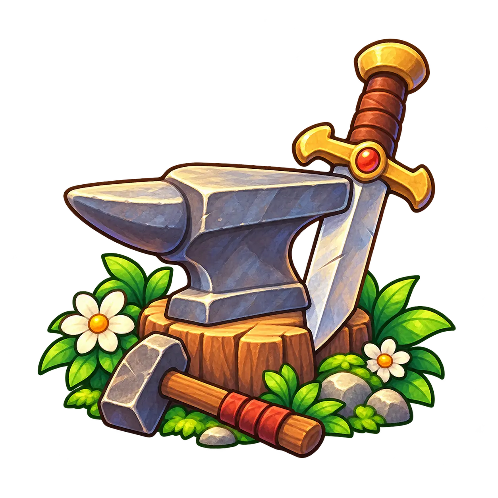

# LoM Workshop

  

  <strong>An open-source modding framework and SDK for building, sharing, and playing Legend of Mana mods.</strong>

> [!IMPORTANT]
> **Status: Coming soon.**
>
> LoM Workshop is currently in the design and early development stage.

LoM Workshop builds on the reverse-engineering work of
[lom-decomp](https://github.com/celophi/lom-decomp) to provide a common
modding environment for **Legend of Mana**.

The goal is to provide a platform-independent mod format, development API,
and set of tools that can support multiple game targets, including the
original PlayStation version and future native PC ports.

## Goals

LoM Workshop aims to make Legend of Mana modding accessible without requiring
mod authors to understand the game's original build system, binary layout, or
platform-specific implementation details.

Mods should be able to describe changes in terms of game concepts rather than
a particular executable or hardware platform.

Where possible, the same mod should be usable across multiple supported
targets.

## Planned Features

- C-based game modifications
- A stable mod development API
- Platform-independent mod packaging
- Asset and game-data replacement
- Script and data editing
- Mod dependency and conflict management
- Mod composition
- Command-line development tools
- Graphical modding tools
- Reproducible build environments
- Support for multiple Legend of Mana targets

## Platform Support

LoM Workshop is designed around platform-independent mods with
platform-specific backends.

### PlayStation

The PlayStation backend will build on
[lom-decomp](https://github.com/celophi/lom-decomp) and the reconstructed
original game.

It may handle tasks such as:

- compiling mod code for the PlayStation
- modifying game executables and overlays
- replacing game resources
- rebuilding disc data
- generating modified game images or patches

The build environment will use a reproducible container containing the
required open-source PlayStation development tools.

### PC

A native PC backend is planned as the preferred long-term environment for
playing and developing larger mods.

A PC target can provide capabilities that are impractical on the original
hardware while preserving the same higher-level mod APIs and formats where
possible.

## Mods

A LoM Workshop mod may contain a combination of:

- code
- assets
- scripts
- game data
- configuration
- target-specific components when necessary

The framework will handle translating or integrating those components for the
selected game target.

The intent is for mod authors to work against a documented LoM Workshop API
rather than directly depending on internal symbols, memory addresses, or
platform-specific implementation details.

## Related Project

LoM Workshop is made possible by
[lom-decomp](https://github.com/celophi/lom-decomp), a matching decompilation
of the original PlayStation release of Legend of Mana.

The decompilation provides the reconstructed game logic, data structures,
asset formats, and system behavior used as the technical foundation for the
Workshop SDK and its platform backends.

## Game Data

LoM Workshop does **not** distribute Legend of Mana game data.

Users are responsible for providing any required game files from a legally
obtained copy of the game.

Mods should distribute only their own content and the information necessary
to apply their changes.

## License

LoM Workshop is licensed under the [MIT License](LICENSE).

---

*Legend of Mana is the property of its respective copyright holders.
LoM Workshop is an independent fan project and is not affiliated with or
endorsed by Square Enix.*
